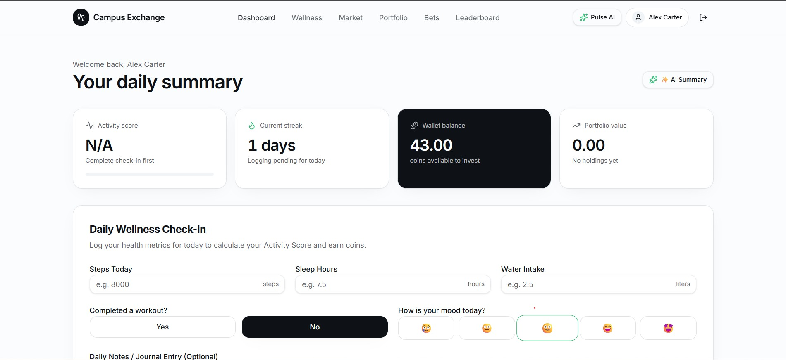
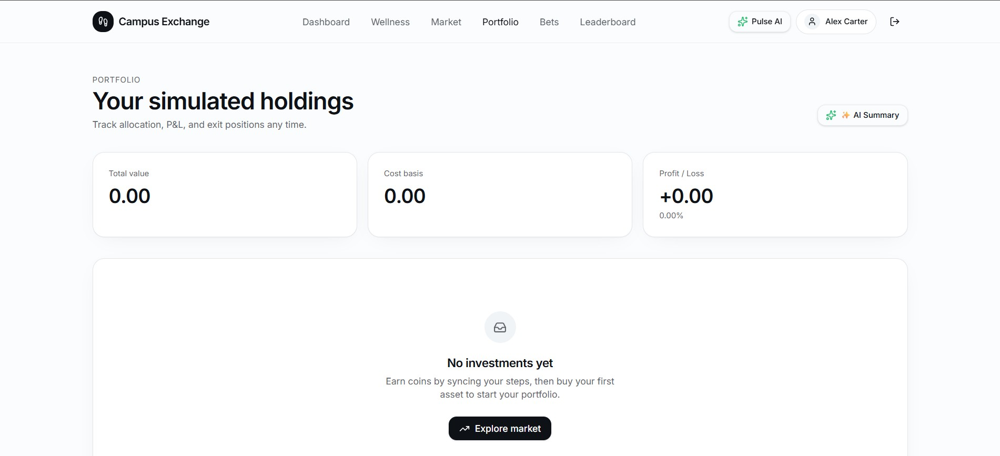
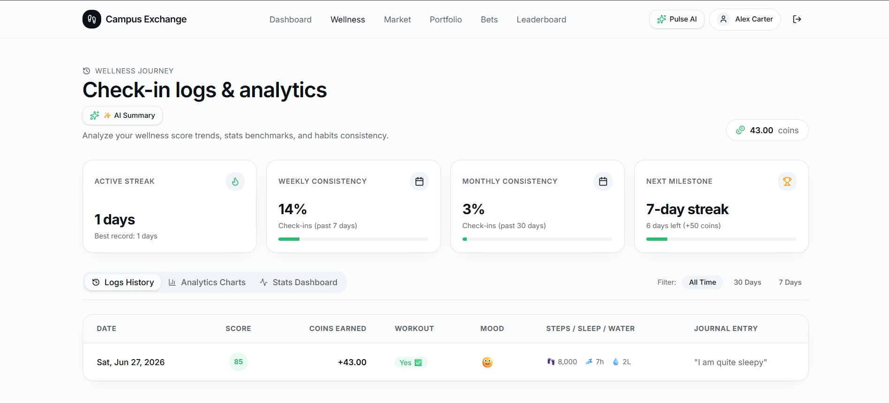
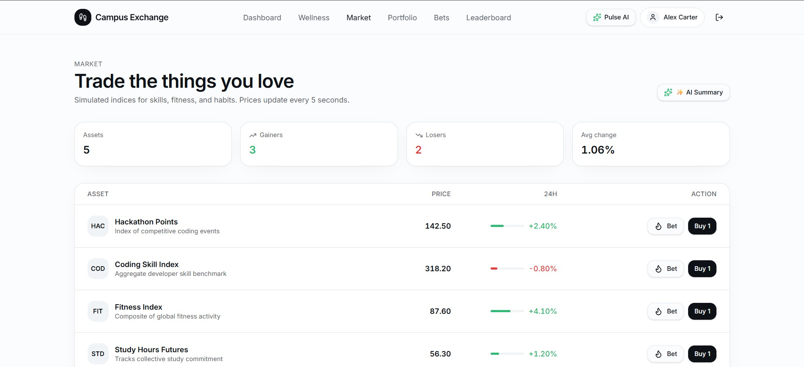
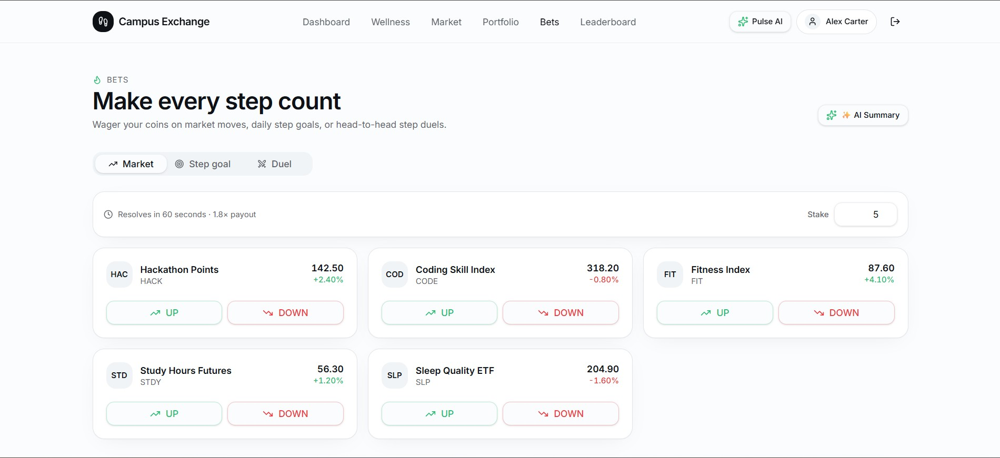
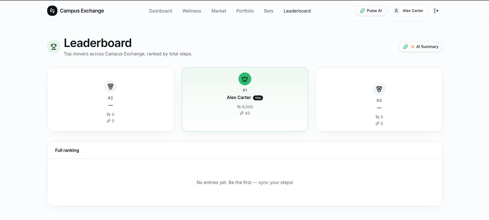
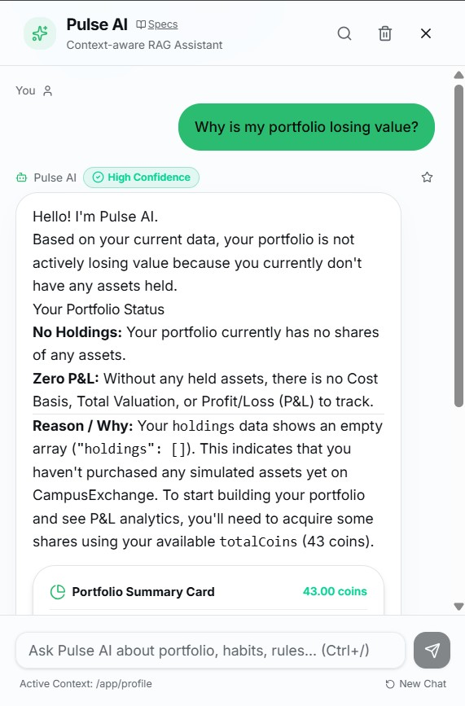
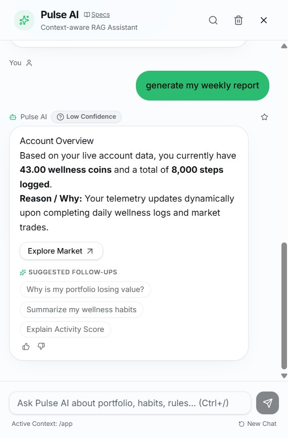
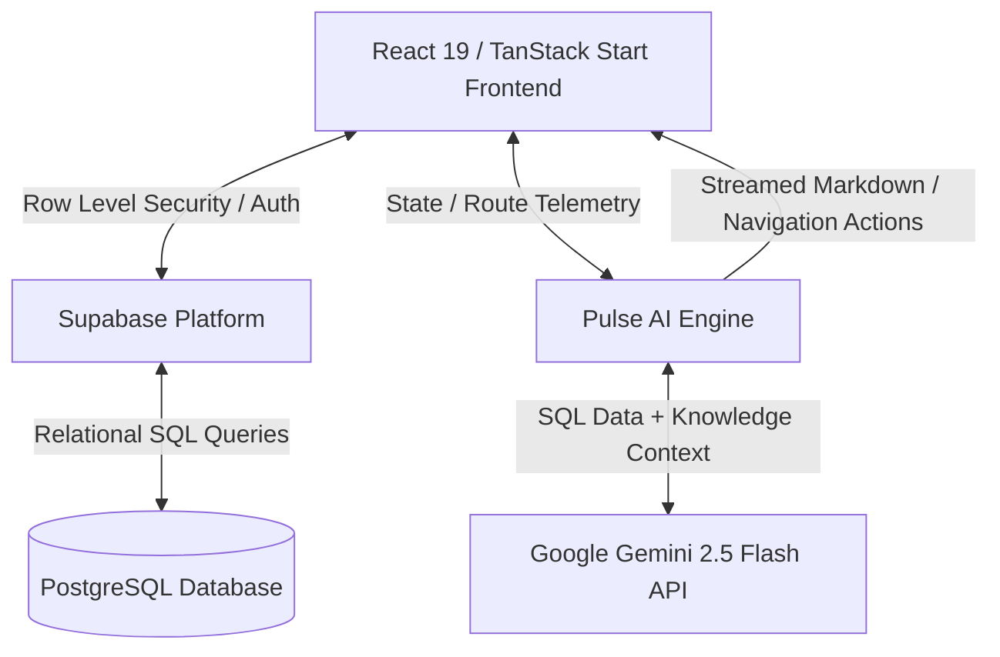
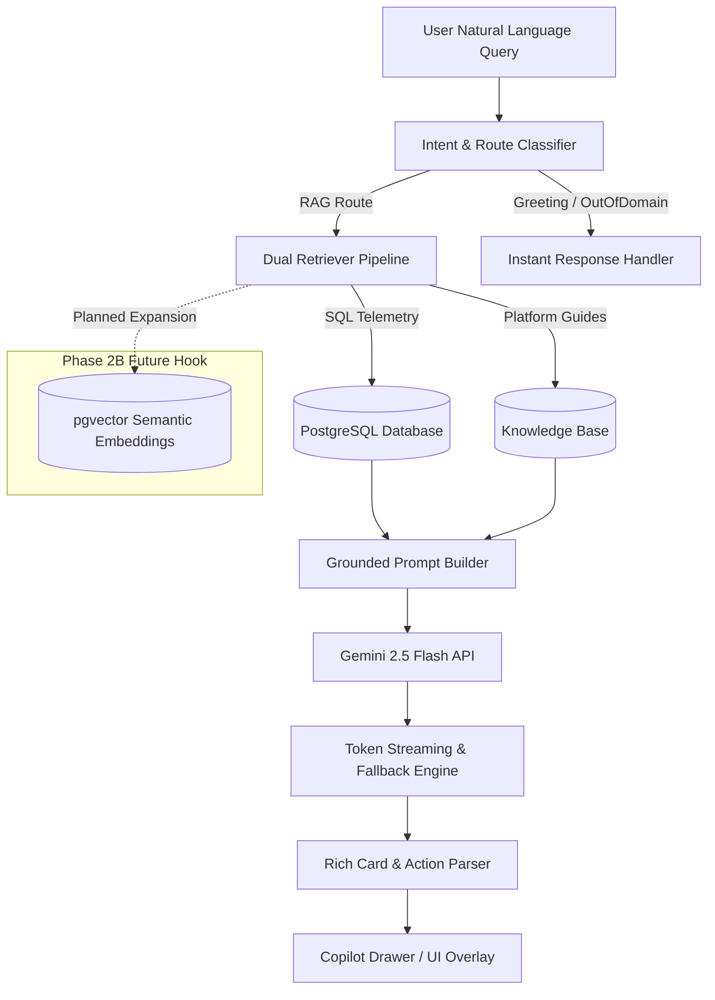

# CampusExchange

> A full-stack financial wellness and virtual trading platform powered by an intelligent, context-aware AI copilot (Pulse AI).

[](https://react.dev/)
[](https://www.typescriptlang.org/)
[](https://supabase.com/)
[](https://ai.google.dev/)
[](https://tailwindcss.com/)
[](https://vite.dev/)

---

## Overview

**CampusExchange** bridges daily physical wellness with virtual financial education. The application incentivizes healthy daily habits—such as step tracking, hydration, sleep, and physical workouts—by converting wellness check-in performance into virtual **wellness coins**. Users invest these coins in simulated asset indices, participate in 60-second market prediction wagers, challenge peers in head-to-head step duels, and consult **Pulse AI**, an integrated retrieval-augmented AI copilot.

### Why CampusExchange Was Built
1. **Gamified Health Literacy**: Encourages consistent physical activity by linking habit tracking directly to virtual market mechanics.
2. **Risk-Free Financial Learning**: Provides a simulated trading environment where users learn portfolio diversification, asset volatility, and wagering strategies without capital risk.
3. **Grounded AI Guidance**: Demonstrates production-grade Retrieval-Augmented Generation (RAG) by grounding AI responses in live database state and platform knowledge bases.

---

## Live Demo

🚀 **Application Preview & Live Deployment**: [https://campus-exchange-ashy.vercel.app](https://campus-exchange-ashy.vercel.app)

---

## Screenshots

| View | Screenshot |
| :--- | :--- |
| **Dashboard** |  |
| **Portfolio Management** |  |
| **Wellness Telemetry** |  |
| **Simulated Market** |  |
| **Prediction Markets & Duels** |  |
| **Campus Leaderboard** |  |
| **Pulse AI Copilot** |  |
| **Weekly Health Report** |  |

---

## Core Features

### 🏃 Wellness Tracking & Telemetry
* **Daily Check-Ins**: Log physical steps, sleep duration (hours), water intake (liters), workouts, mood, and reflection journals.
* **Activity Score Formula**: Dynamic health scoring calculated across weighted pillars (Steps max 40, Sleep max 20, Water max 20, Workout max 20).
* **Streak Bonuses**: Automated tracking of daily check-in consistency with milestone coin rewards.
* **History & Analytics**: Comprehensive trend charts and statistical benchmarks comparing weekly and monthly habit consistency.

### 📈 Virtual Trading & Market Simulation
* **Simulated Skill Futures**: Live trading engine supporting asset indices based on developer skills, habit futures, and productivity tickers (`CODE`, `HACK`, `FIT`, `STDY`, `SLP`).
* **Real-Time Price Drift**: Automated price movement algorithm updating every 5 seconds using momentum retention and random variance.
* **Portfolio Analytics**: Live calculation of total portfolio value, cost basis, unrealized Profit & Loss (P&L), and percentage return.

### 🎲 Prediction Markets & Duels
* **60-Second Market Bets**: Predict whether an asset index will rise or fall over 60 seconds for a 1.8x multiplier.
* **Goal Wagers**: Wager wellness coins on hitting target step milestones before midnight for a 2.0x payout.
* **Step Duels**: Head-to-head 24-hour step battles challenging peers for the combined coin pot.

### 🧠 Pulse AI Copilot (SQL-Grounded AI Generation)
* **SQL-Grounded Context Engine**: Queries live PostgreSQL database telemetry and platform knowledge bases directly to feed exact context into Gemini 2.5 Flash, guaranteeing zero hallucinations on financial numbers.
* **Modular Architecture for Phase 2B pgvector**: Designed with pluggable retrieval interfaces in `retriever.ts` ready to incorporate pgvector semantic document search in Phase 2B.
* **Page & Context Awareness**: Automatically interprets user queries like *"Explain this"* based on the active route and view state.
* **Universal Page Summaries (`✨ AI Summary`)**: One-click inline cards analyzing portfolio concentration, habit trends, and market volatility.
* **Navigation Automation**: Interprets natural language commands like *"Take me to my portfolio"* and executes client-side routing.
* **Rich Visual Cards & Mini-Charts**: Renders structured summary cards, inline trend charts, confidence badges, and activity timelines directly within conversation threads.
* **Report Export**: Generates and exports comprehensive Weekly Health & Financial Reports as downloadable Markdown documents.

---

## System Architecture



---

## AI Pipeline Architecture



---

## Technology Stack

| Domain | Technology | Purpose |
| :--- | :--- | :--- |
| **Frontend Framework** | React 19 / TanStack Start | Full-stack SSR/SPA architecture with type-safe routing |
| **Language** | TypeScript 5.7 | End-to-end static typing across routes, APIs, and models |
| **Database & Auth** | Supabase (PostgreSQL) | Production relational database, Row Level Security, and auth |
| **AI / LLM Integration** | Google Gemini 2.5 Flash | High-throughput streaming generative AI synthesis |
| **Styling & UI** | Tailwind CSS v4 / Shadcn UI | Custom dark-mode design system and responsive primitives |
| **Charts & Visualization** | Recharts | Interactive area charts, historical analytics, and mini-charts |
| **Validation** | Zod | Runtime schema validation for check-ins and forms |
| **Build System** | Vite 7.3 | High-performance ES modules bundler and dev server |

---

## Folder Structure

```
campus-exchange/
├── scripts/              # Build & deployment helper scripts (sync-vercel.js)
├── src/
│   ├── components/       # Global UI components (Navbar, Footer, Shadcn primitives)
│   ├── constants/        # Application constants and configuration defaults
│   ├── features/         # Feature-bound UI modules
│   │   ├── bets/         # Market, Goal, and Duel wager components
│   │   ├── copilot/      # Pulse AI panel, rich cards, mini-charts, summarizers
│   │   ├── dashboard/    # Daily telemetry stat cards and check-in forms
│   │   ├── leaderboard/  # Podium and global ranking tables
│   │   ├── market/       # Simulated asset exchange lists and pulse cards
│   │   ├── portfolio/    # Asset allocation bars and holdings tables
│   │   ├── profile/      # User profile cards and activity grids
│   │   └── wellness/     # Health history tables, benchmark charts, dashboards
│   ├── hooks/            # Custom React hooks (useApp, usePortfolio, useWellness, useMarket)
│   ├── integrations/     # Supabase client instances, middleware, and TypeScript definitions
│   ├── lib/              # Shared utilities and store helpers
│   ├── routes/           # TanStack file-based routing tree (`/app/*`, `/app/ai-architecture`)
│   ├── schemas/          # Zod validation schemas for forms and check-ins
│   ├── services/         # API services and business logic (trading, wellness, bets)
│   │   └── copilot/      # RAG retriever, intent router, prompt builder, server functions
│   └── types/            # TypeScript interface declarations
├── supabase/             # Supabase database migrations and project config
├── public/               # Static web assets
└── docs/                 # Screenshots and architectural documentation
```

---

## Installation & Local Setup

### 1. Prerequisites
Ensure you have **Node.js (v18+)** or **Bun** installed on your system.

### 2. Clone Repository
```bash
git clone https://github.com/piyush2180/campus-exchange.git
cd campus-exchange
```

### 3. Install Dependencies
```bash
npm install
```

### 4. Configure Environment Variables
Create a `.env` file in the root directory:
```env
VITE_SUPABASE_URL="https://your-supabase-project.supabase.co"
VITE_SUPABASE_PUBLISHABLE_KEY="your-supabase-publishable-key"
VITE_GEMINI_API_KEY="your-google-gemini-api-key"
```

### 5. Start Development Server
```bash
npm run dev
```
Open your browser and navigate to `http://localhost:3000`.

---

## Engineering Highlights

* **SQL-First Grounding**: Financial holdings, wallet balances, and health logs are queried directly from PostgreSQL to guarantee zero hallucination on user telemetry.
* **Resilient Stream Fallback**: Features a local grounded synthesis fallback engine so users receive immediate, accurate responses even if external LLM API rates are exceeded.
* **Extensible Vector Architecture**: Built with pluggable retrieval interfaces prepared for Phase 2B pgvector semantic document retrieval.
* **Type-Safe Full-Stack Design**: Strict TypeScript contracts spanning Supabase schemas, TanStack routes, and component interfaces.

---

## Future Roadmap

- [x] Supabase Authentication & Row Level Security
- [x] Simulated Asset Index Trading Engine
- [x] Daily Wellness Tracking & Activity Score Algorithm
- [x] 60s Market Predictions & Step Duels
- [x] Pulse AI Copilot with Grounded SQL Retrieval
- [x] Universal Page AI Summaries & Navigation Actions
- [ ] Phase 2B: pgvector Semantic Embedding Retrieval
- [ ] Real-Time WebSockets for Peer Step Duels
- [ ] Native Mobile App (React Native / Expo)

---

## Contributing

Contributions, issues, and feature requests are welcome! Feel free to check the [issues page](https://github.com/piyush2180/campus-exchange/issues).
